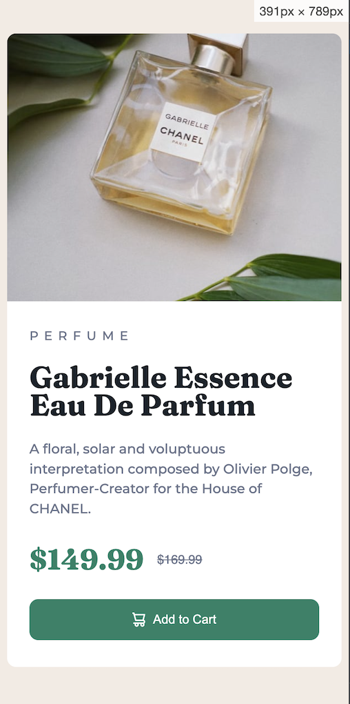

# Frontend Mentor - Product preview card component solution

This is a solution to the [Product preview card component challenge on Frontend Mentor](https://www.frontendmentor.io/challenges/product-preview-card-component-GO7UmttRfa). Frontend Mentor challenges help you improve your coding skills by building realistic projects. 

## Table of contents

- [Overview](#overview)
  - [The challenge](#the-challenge)
  - [Screenshot](#screenshot)
  - [Links](#links)
- [My process](#my-process)
  - [Built with](#built-with)
  - [What I learned](#what-i-learned)
  - [Continued development](#continued-development)
- [Author](#author)

## Overview

### The challenge

Users should be able to:

- View the optimal layout depending on their device's screen size
- See hover and focus states for interactive elements

### Screenshot

### Links

- Solution URL: [Add solution URL here](https://your-solution-url.com)

## My process
Understandably could have started designing this for mobile and worked toward desktop.
Instead worked from desktop; the layout suggested two inline-block elements at first glance. One for the image and another more complex one for the text content.
Looking at the mobile layout, I knew these would have to lose their display: inline-block property. From there it made sense to use a media query to set up a suitable break point where the relevant properties would be replaced.

### Built with

- Semantic HTML5 markup
- CSS custom properties
- Flexbox

### What I learned

My biggest takeaway from this is that it wold have been simpler to use flexbox or grid, or even possibly add Bootstrap.
Resorted to using Flex on the elements containing the prices to align them vertically. Just could not make this work without it.
I suspect it could have been simpler than what I ended up with.

### Continued development

I am focussing on trying to write the simplest, most functional code I can without resorting to external frameworks. I'll be happy to on once I feel that my basic HTML and CSS chops are as good as they can be.
Then more CSS, use of Flex, Grid and JavaScript, maybe Bootstrap or a similar framework.

## Author

- Frontend Mentor - [@yourusername](https://www.frontendmentor.io/profile/yourusername)
- Twitter - [@Martin_Coton](https://www.twitter.com/Martin_Coton)
